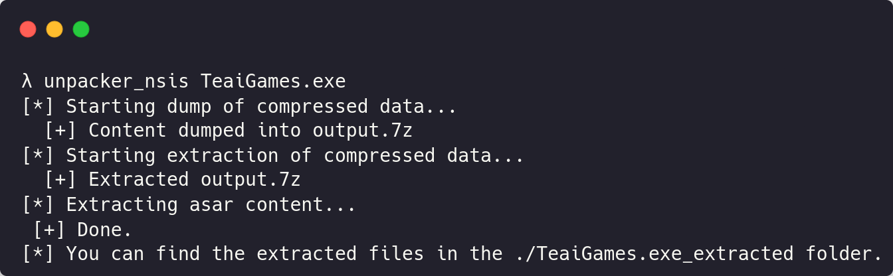

# nova_unpacker

This unpacker was specifically made for unpacking [Nova Sentinel's Stealer](https://malpedia.caad.fkie.fraunhofer.de/details/win.nova) which is packed as an NSIS application, and it's code is hidden behind an Electron app. The tool can also work with other similarly packed softwares, as [Epilon's Stealer](https://malpedia.caad.fkie.fraunhofer.de/details/win.epsilon_stealer) for example.

## Exemple of use

You will then get the source code of the executable inside the extracted folder.
